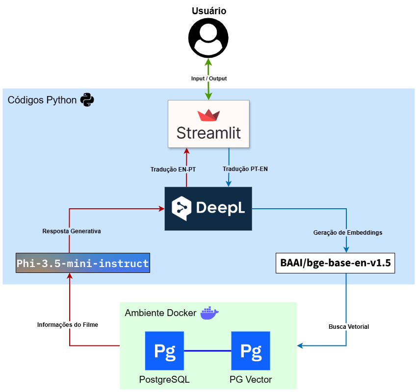

<h1 align="center"> Cinebot - Chatbot de Recomendação de Filmes </h1> 


<h2>Objetivo da aplicação</h2>

Este projeto foi desenvolvido como tema do meu Trabalho de Conclusão de Curso, e tem como objetivo a implementação de um Chatbot conversacional especializado na recomendação de filmes com base em uma descrição natural do usuário, utilizando ferramentas totalmente open source. 

<h2>Descrição da aplicação</h2>

A aplicação foi desenvolvida com técnicas de Processamento de Linguagem Natural (NLP) e o modelo RAG (Recuperação Aumentada por Geração). Ao invés de recomendar filmes com base em histórico ou popularidade, o sistema entende descrições livres inseridas pelo usuário e retorna sugestões personalizadas com base no significado do texto. A aplicação é dividida em duas etapas:

* A primeira etapa foi a realização do ETL de dados, no qual foi utilizado um dataset do Kaggle com informações de mais de um milhão de filmes. As informações foram extraídas, tratadas para o caso de uso, e a partir disso, criado um dataset específico para a aplicação. As informações desse novo dataset foram utilizadas como referência para a busca semântica (título, gênero do filme, palavras-chaves, etc), sendo transformadas em embeddings, indexadas e armazenadas no banco vetorial. Nessa primeira etapa, os dados estão prontos para serem consultados.

* A segunda etapa é justamente a consulta de dados, no qual é realizado o input pelo o usuário e o chatbot transforma essa entrada em embeddings, realiza uma busca semântica utilizando a similaridade de cosseno no banco de dados com as representações vetoriais dos filmes, e então utiliza um modelo de linguagem (LLM) para gerar uma resposta contextualizada e natural à partir das informações encontradas.

O sistema foi construído, com tecnologias open source e visa melhorar a experiência do usuário frente ao paradoxo da escolha, oferecendo recomendações mais precisas, naturais e alinhadas ao interesse real descrito em linguagem comum.

<h2>Estrutura da aplicação</h2>

<p align="center">
  
</p><br>

**Funcionamento:** 

1. Usuário interage com a interface Streamlite, descrevendo o filme buscado;
2. É feito a normalização e tradução de input (PT-EN), com o DeepL;
3. O input é convertido em embeddings, através do modelo "BAAI/bge-base-en-v1.5";
4. É realizado a busca vetorial no banco de dados, utilizando o PostgreSQL + PGVector, localizando as informações do filme;
5. As informações encontradas são enviada para o LLM "Phi-3.5-mini-instruct-Q5_K_M", que cria uma resposta generativa em inglês;
6. A resposta generativa é traduzida (EN-PT), e devolvida ao usuário através da interface.

**Tecnologias utilizadas:**

- Python
- Streamlit
- DeepL 
- Indexação HNSW + PostgreSQL + PGVector
- Sentence-Transformers
- llama-cpp-python
- Docker Desktop on Windows (opcional para ambiente local)

**Bibliotecas utilizadas:**

- pandas==2.2.3
- psycopg2==2.9.10
- sentence-transformers==4.1.0
- pgvector==0.4.1
- deepl==1.22.0
- llama-cpp-python==0.3.9

<h2>Execução da aplicação</h2>

Caso não tenha as bibliotecas necessárias instaladas, execute o seguinte comando para instalar (recomendado criar um venv):

```bash
pip install -r requirements.txt
```

**Datasets:**

O dataset original não está incluso no repositório, tendo apenas o dataset tratado e pronto para utilização, contendo as seguintes colunas: movie, release_year, overview, genres, keywords e movie_data.<br> 
A coluna "movie_data" contém dados relevantes concatenados, e posteriormente, convertidos em embeddings e armazenados no banco vetorial, sendo a referência para a busca semântica.<br><br>

Caso queira realizar alterações, modificar no arquivo *dataset_processing.py* e executar para criar o novo dataset. Caso contrário, apenas siga os passos abaixo.

**Eexecutar a aplicação:**

A seguir está o passo a passo de como inicar as configurações necessárias para executar a aplicação:

1. Baixe o modelo "Phi-3.5-mini-instruct-GGUF" para a seguinte pasta: cinebot_application/data/llm (link no final da página);

2. Ativar o Docker Desktop;

3. Executar o seguinte comando para criar o conteiner Docker com PostgreSQL + PGVector + tabela:

```bash
docker-compose up -d
```

4. Executar o arquivo "insert.py" para inserir os dados no Banco de Dados;

5. Executar a interface do chatbot:

```bash
streamlit run app/interface.py
```

Observação: Sempre que for utilizar a aplicação, é necessário ativar o conteiner diretamente no Docker.
  
<h2>Links</h2>

Dataset original de filmes do kaggle: [tmdb-movies-dataset](https://www.kaggle.com/datasets/asaniczka/tmdb-movies-dataset-2023-930k-movies)<br>
Modelo de Embeddings Huggingface: [BAAI/bge-large-zh-v1.5](https://huggingface.co/BAAI/bge-base-en-v1.5#using-sentence-transformers)<br>
Modelo Generativo Huggingface: [Phi-3.5-mini-instruct](https://huggingface.co/bartowski/Phi-3.5-mini-instruct-GGUF/blob/main/Phi-3.5-mini-instruct-Q5_K_M.gguf)
